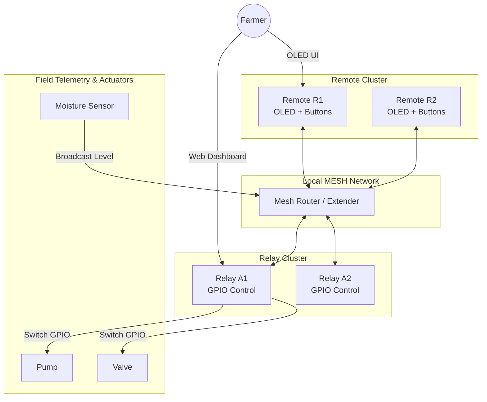

# ESP-Farm: Smart Irrigation Mesh Network Control System

ESP-Farm is a role-based, self-forming, and self-recovering smart irrigation and telemetry mesh network built on ESP32 microcontrollers. The system allows operators to control farm utilities, view real-time link quality indicators, collect moisture telemetry, configure scheduler timers, and establish edge-automation rules locally without internet or cloud dependencies.

---

## Key Features

*   **Self-Healing Mesh**: Nodes communicate over a self-forming local mesh network (`painlessMesh` over Wi-Fi) that dynamically reroutes messages in case of node drops or link breaks.
*   **Role-Based Architectures**:
    *   **Relay Node (`esp_relay`)**: Actuator controller containing the logical device-to-GPIO mapping table, scheduler, automation engine, in-memory log buffer, and the local HTTP/WebSocket dashboard stack.
    *   **Remote Node (`esp_remote`)**: Field controller with a 3-button, 6-tile SSD1306 OLED interface for manual actuator toggles, settings configuration, and RSSI monitoring.
    *   **Sensor Node (`esp_sensor`)**: Telemetry publisher broadcasting soil moisture readings to the mesh network.
    *   **Extender Node (`esp_extender`)**: Router node that handles multihop forwarding only to extend network reach.
*   **Dynamic UI Synchronization**: Remote device control tiles are relay-driven. Remotes pull active slot mappings at runtime, updating tiles dynamically without hardcoding configurations.
*   **Offline Web Dashboard**: Provides a zero-dependency local dashboard served directly by the relay via HTTP/WebSockets for live device monitoring, scheduling configuration, and threshold-based sensor automation.
*   **Reliable Messaging**: Robust stop-and-wait ACK protocol with automated retries (up to 3 times) and time-windowed duplicate-packet suppression.
*   **Power Optimization**: Always-On Display (AOD) timeout sleep mode with interrupt-driven wake filters to prevent accidental toggle actions on battery-operated remotes.

---

## System Architecture



---

## Hardware Configuration & Pinout

### Remote Node (`esp_remote`)
*   **MCU**: ESP32 DOIT DevKit V1
*   **OLED Display**: SSD1306 (I2C) -> `SDA = GPIO 21`, `SCL = GPIO 22`
*   **Input Buttons**: 
    *   `UP` -> `GPIO 16` (INPUT_PULLUP)
    *   `SEL` -> `GPIO 17` (INPUT_PULLUP) [Short press = Select, Long press = Back]
    *   `DOWN` -> `GPIO 18` (INPUT_PULLUP)

### Relay Node (`esp_relay`)
*   **MCU**: ESP32 DOIT DevKit V1
*   **OLED Display**: SSD1306 (I2C) -> `SDA = GPIO 21`, `SCL = GPIO 22`
*   **Status Indicator**: onboard LED -> `GPIO 2`
*   **Physical Actuators**: Configurable mapping up to 5 devices (Default bindings: Pump -> `GPIO 13`, Valve -> `GPIO 19`, Light -> `GPIO 23`, Motor -> `GPIO 4`, Auxiliary -> `GPIO 15`).

### Sensor Node (`esp_sensor`)
*   **MCU**: ESP32 DOIT DevKit V1
*   **Sensor Pin**: Analog ADC -> `GPIO 33`

---

## Developer Setup & Installation

The project is structured as a PlatformIO multi-environment project.

### Prerequisites
1.  Install [VS Code](https://code.visualstudio.com/) and the [PlatformIO IDE extension](https://platformio.org/platformio-ide).
2.  Clone this repository to your local workspace.

### Library Dependencies
All dependencies are declared in `platformio.ini` and automatically retrieved by PlatformIO during the build process:
*   `painlessMesh/painlessMesh @ ^1.5.0`
*   `bblanchon/ArduinoJson @ ^7.4.2`
*   `adafruit/Adafruit SSD1306 @ ^2.5.7`
*   `links2004/WebSockets @ ^2.4.1`

### Build and Upload Firmware

Open your terminal or use PlatformIO commands in VS Code to build and flash specific target roles:

```bash
# Build all target environments
pio run

# Flash the Relay firmware (Node A)
pio run -e esp_relay -t upload

# Flash the Remote firmware (Node B)
pio run -e esp_remote -t upload

# Flash the Extender firmware (Node C)
pio run -e esp_extender -t upload

# Flash the Sensor telemetry firmware (Node D)
pio run -e esp_sensor -t upload

# Open Serial Monitor for Relay node
pio device monitor -e esp_relay
```

---

## Local Web Dashboard

The relay node serves an embedded Web UI interface for real-time remote configuration.

*   **URL**: `http://esp-agri-relay.local/` (mDNS) or target IP address (HTTP port `80`)
*   **WebSocket Endpoint**: `ws://<relay-ip>:81/`
*   **Features**:
    *   *Real-Time Status*: Live connection monitoring and device status toggles.
    *   *Logical Config*: Reconfigure slots with custom Device IDs, GPIO pins, and active-high/low polarity.
    *   *Timer Scheduler*: Assign delay countdowns and run durations for independent devices.
    *   *Sensor Automation*: Set threshold conditions where device actions trigger based on incoming soil moisture levels.

---

## Serial Command Line Interface (CLI)

Both remote and relay nodes support runtime configuration over a unified Serial CLI (`115200` baud).

*   `AGRI_GET_CFG`: Returns the active configuration (Role, Farm ID, Device Bindings, Node ID) in JSON format.
*   `AGRI_SET_CFG <json>`: Applies and persists configuration variables to ESP32 Non-Volatile Storage (NVS).

---

## Message Protocol Schema

ESP-Farm uses a compact JSON schema (designed to stay under 100 bytes for radio compatibility) to exchange mesh commands:

| Key | Description | Example |
| :--- | :--- | :--- |
| `f` | Farm Identification tag | `"FARM_102"` |
| `d` | Logical target device ID | `"PUMP_01"` |
| `src` | Sender logical ID | `"REMOTE01"` |
| `c` | Protocol command integer | `3` (CMD_DEV_ON) |
| `m` | Monotonic message counter | `128` |
| `t` | Creation timestamp | `213054` |
| `n` | Nonce index helper | `42` |
| `s` | State value payload | `1` (ON) |

---

## Directory Layout
```text
├── data/                  # Embedded Web assets
├── docs/                  # In-depth architectural/guide documents
│   ├── ARCHITECTURE.md    # Layering model and protocol commands
│   ├── CODE_ANALYSIS.md   # Shared library structure and known constraints
│   ├── DISPLAY_UIUX.md    # OLED menu navigation states
│   └── WEB_DASHBOARD.md   # Web interface protocol and configurations
├── lib/AgriCore/          # Shared core library (NVS, display, protocol wrappers)
├── src/                   # Application layer roles
│   ├── esp_relay.cpp      # Relay actuator firmwares
│   ├── esp_remote.cpp     # Remote field UI controller firmwares
│   ├── esp_extender.cpp   # Routing node source code
│   └── esp_sensor.cpp     # Moisture telemetry source code
└── platformio.ini         # Environment configuration
```
