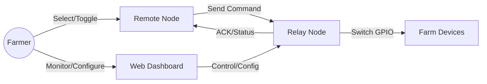
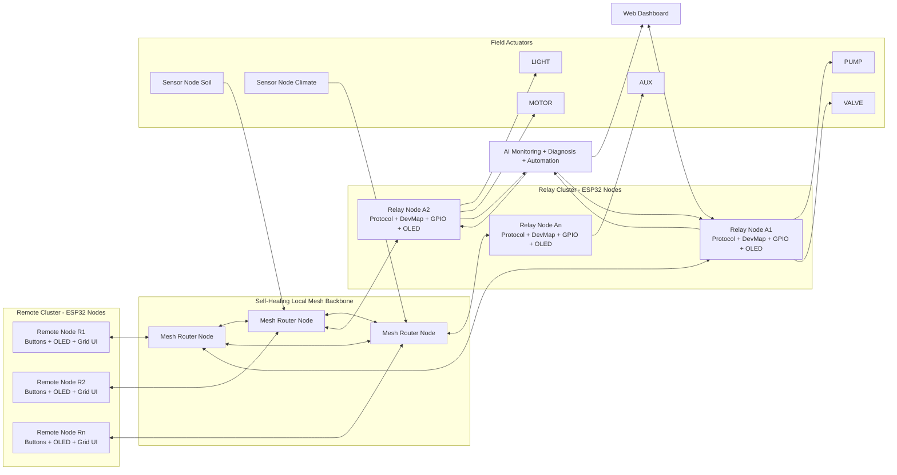
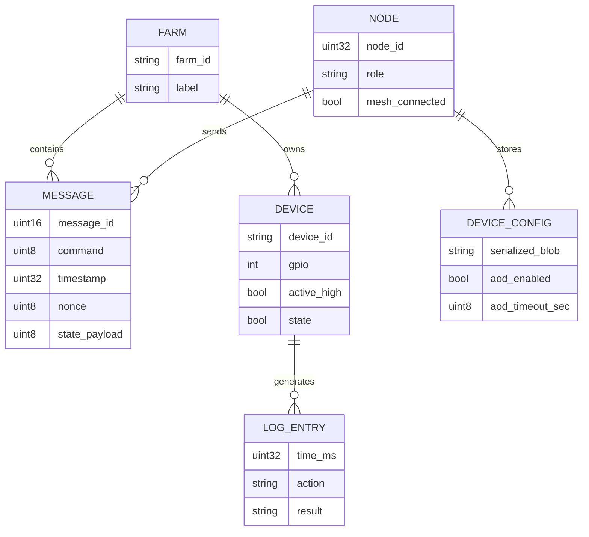
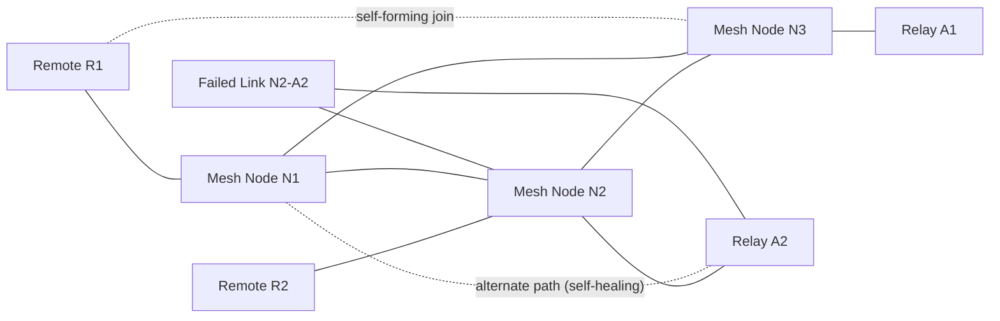

# ESP-Farm Project Report

## 1 Introduction

ESP-Farm is a multi-node self-healing smart irrigation control system built on ESP32 devices. Nodes can operate in relay/controller, remote/control, and sensor-node roles, and all nodes communicate over a self-forming, self-recovering local mesh network (current implementation: ESP-MESH via `painlessMesh`). The system supports farm-aware command routing, sensor telemetry collection, AI-assisted monitoring/diagnosis, and automation through local and dashboard interfaces.

### 1.1 Modules

- Communication module (`agri_transport`, `agri_mesh_wifi`)
- Sensor acquisition module (soil/moisture/environment nodes)
- Protocol module (`agri_protocol`)
- UI module (`agri_display`, `agri_gridui`)
- Device control module (`agri_devmap`)
- Persistence module (`agri_nvs`)
- Monitoring module (`agri_range`, `agri_rssi`)
- Analytics/AI module (farm health scoring, anomaly detection, recommendations)
- Automation module (rule + AI-triggered control actions)
- Logging module (`agri_log`)
- Application layer (`src/esp_relay.cpp`, `src/esp_remote.cpp`)

### 1.2 Objectives

- Enable reliable remote control of irrigation devices.
- Provide low-latency local mesh communication across multiple nodes.
- Maintain self-healing connectivity under node join/leave and path changes.
- Collect farm data continuously using distributed sensor nodes.
- Use AI to monitor trends, diagnose abnormal conditions, and support decisions.
- Enable reliable automation actions from rule/AI insights.
- Support multiple logical devices (pump/valve/light/motor/aux).
- Offer a simple 3-button OLED interface for field operation.
- Track link health (range/RSSI) and improve operator awareness.
- Persist critical settings (farm, AOD, device mapping).

## 2 Literature Survey

### 2.1 Existing System

Traditional irrigation setups are either:
- Manual relay switching (high human dependency), or
- Wi-Fi/cloud dependent IoT systems (internet dependency, latency, and outage risk).

Common limitations in existing systems:
- No local offline control path.
- Weak feedback for communication quality.
- Limited support for farm-level segmentation.
- Poor usability in low-connectivity agricultural environments.

### 2.2 We Developed System

The developed ESP-Farm system introduces:
- Local mesh-based control without internet dependency.
- Distributed sensor-node data collection for farm telemetry.
- Farm ID based message validation and filtering.
- ACK/retry logic for command reliability.
- Relay-driven dynamic device-list sync for remote UI tiles.
- AI-assisted monitoring and diagnosis from historical + live sensor data.
- Automation flow where device actions can be triggered from validated rules/AI outputs.
- Role-based display UX on both remote and relay nodes.
- Relay-side web dashboard for monitoring/configuration.
- Reconfigurable logical device-to-GPIO binding.

## 3 Structure of System

### 3.1 Use Case Diagram

### 3.2 Block Diagram

### 3.3 ER Diagram

## 4 Methodology

### 4.1 Methodology

- Requirement analysis for farm-side constraints (offline-first, simple UI).
- Layered architecture design (application, transport, protocol, UI/control).
- Incremental module development in shared `AgriCore` library.
- Dual-role firmware development with compile-time role flags.
- Integration testing via PlatformIO environments (`esp_relay`, `esp_remote`).
- Validation through serial logs, OLED UX verification, and upload tests.

### 4.2 Action Plan

1. Define protocol, constants, and transport interfaces.
2. Implement mesh transport and callback model.
3. Build relay device map and command execution path.
4. Build remote UI flow and ACK/retry behavior.
5. Add range/RSSI monitoring and display integration.
6. Add NVS persistence for farm/AOD/device config.
7. Add relay web dashboard for runtime observability.
8. Final documentation and architecture consistency review.

## 5 Implementation

### 5.1 Hardware Component

- Multiple ESP32 DOIT DevKit V1 boards (scalable node count)
- 2 × SSD1306 OLED displays (I2C, 128×64)
- 3 × push buttons on remote/relay navigation lines (UP/SEL/DOWN)
- Relay output channels mapped to GPIOs
- Loads/actuators: Pump, Valve, Light, Motor, Auxiliary device

### 5.2 Software Component

- Framework: Arduino (PlatformIO)
- Language: C++
- Libraries:
  - painlessMesh (current mesh transport implementation)
  - ArduinoJson
  - Adafruit SSD1306
  - WebSockets
- Core files:
  - `src/esp_relay.cpp`
  - `src/esp_remote.cpp`
  - `lib/AgriCore/*`

### 5.3 Implementation Steps

1. Configure PlatformIO multi-environment build.
2. Implement shared protocol and transport abstractions.
3. Implement role-specific application logic.
4. Integrate OLED grid UI and 3-button navigation.
5. Implement ACK/retry and duplicate filtering.
6. Add NVS settings and device config persistence.
7. Integrate relay web dashboard and live status channel.
8. Perform integration build/upload checks.

## 6 Working Process

1. Remote requests current device-list snapshot from relay.
2. Relay responds with per-slot device bindings/states (dashboard-configurable mapping).
3. Remote applies tile bindings dynamically and user confirms device action.
4. Remote sends mesh command with farm ID + message ID.
5. Relay validates farm and duplicate window.
6. Relay maps logical device ID to GPIO and applies ON/OFF/TOGGLE.
7. Relay sends ACK/STATUS back to remote.
8. Remote clears pending state and updates tile status.
9. Sensor nodes periodically publish farm telemetry (soil/environment data).
10. AI layer evaluates trends/anomalies and generates diagnosis/recommendations.
11. Approved automation logic triggers control actions on relay nodes.
12. Range/RSSI modules continuously refresh link quality indicators.
13. Dashboard clients receive status, telemetry, and AI insights via WebSocket/API.

### 6.1 How Mesh Network Works (Self-Forming + Self-Healing)

In ESP-Farm, each ESP32 node boots with the same mesh profile and authentication parameters. The mesh forms automatically without manual router configuration.

Self-forming behavior:
- New node powers on and starts mesh discovery.
- Node scans nearby peers and exchanges hello/control frames.
- Node joins best available parent/path and becomes reachable in the cluster.
- Routing table updates propagate so nodes can forward messages multi-hop.

Self-healing behavior:
- If a node/link drops, neighbor timeout detects path loss.
- Mesh recalculates alternate route via remaining nodes.
- Application traffic resumes over new path without manual intervention.
- Node count/connectivity callbacks update OLED/dashboard status.

### 6.2 Communication Ranges

The current firmware uses ESP-MESH over Wi-Fi (`painlessMesh`). Practical range depends on line-of-sight, interference, antenna placement, and transmit environment.

Typical guideline ranges (current Wi-Fi mesh implementation):

| Scenario | Typical Single-Hop Range |
|---|---|
| Dense obstruction / indoor | 10 m – 40 m |
| Semi-open farm buildings | 30 m – 120 m |
| Open outdoor line-of-sight | 80 m – 250+ m |

Mesh extension behavior:
- End-to-end distance increases by adding intermediate nodes.
- Example: if average stable hop is 80 m, three hops can cover ~240 m corridor.
- Self-healing rerouting maintains coverage when one path drops.

Operational signal-quality bands (design guidance):

| RSSI Band | Link Quality | Action |
|---|---|---|
| Better than -65 dBm | Strong | Normal operation |
| -65 to -75 dBm | Usable | Monitor retries / placement |
| -75 to -85 dBm | Weak edge | Improve node placement or add relay node |
| Below -85 dBm | Unreliable | Expect packet loss / route breaks |

## 7 Proposed Scope

- Multi-relay and multi-remote cluster scaling.
- Large-scale sensor-node deployment for zone-wise farm visibility.
- Mesh network optimization (latency, reliability, placement planning).
- AI model improvement for prediction, diagnosis, and prescriptive actions.
- Rule-based automation and schedules.
- Closed-loop autonomous irrigation/farm control with human override.
- Enhanced fault alerting and diagnostics.
- OTA firmware management workflow.

## 8 Proposed Application

- Smart irrigation pump and valve control.
- Precision irrigation based on soil and weather telemetry.
- AI-based stress detection (water deficit, over-irrigation, abnormal conditions).
- Greenhouse environmental actuator control.
- Farm utility automation in low-network zones.
- Community/shared farm distributed control.

## 9 Proposed Limitation

- No end-to-end message encryption/authentication in current protocol.
- Duplicate filtering key scope can be improved for dense multi-sender setups.
- Dashboard interactions require careful Wi-Fi coexistence planning in noisy RF environments.
- AI output quality depends on sensor quality, calibration, and historical data volume.
- Automation decisions require guardrails to avoid false-positive actuation.
- Current UX focuses on compact screens; advanced analytics are limited.

## 10 Conclusion

ESP-Farm demonstrates a practical, offline-capable smart farm control architecture using low-cost ESP32 hardware. The system combines mesh communication, reliable command acknowledgement, role-aware UI, and configurable device mapping. It is suitable as a robust foundation for field deployment and further expansion toward automation and transport flexibility.

## 11 References

1. PlatformIO Documentation: https://docs.platformio.org/
2. painlessMesh Documentation: https://gitlab.com/painlessMesh/painlessMesh
3. ArduinoJson Documentation: https://arduinojson.org/
4. Adafruit SSD1306 Library: https://github.com/adafruit/Adafruit_SSD1306
5. ESP32 Arduino Core: https://github.com/espressif/arduino-esp32
6. Project docs: `docs/ARCHITECTURE.md`
7. Project docs: `docs/DISPLAY_UIUX_GUIDE.md`
8. Project docs: `docs/WEB_DASHBOARD.md`
9. Project docs: `docs/MIGRATION_CHECKLIST.md`
10. Project docs: `docs/CODE_ANALYSIS.md`
